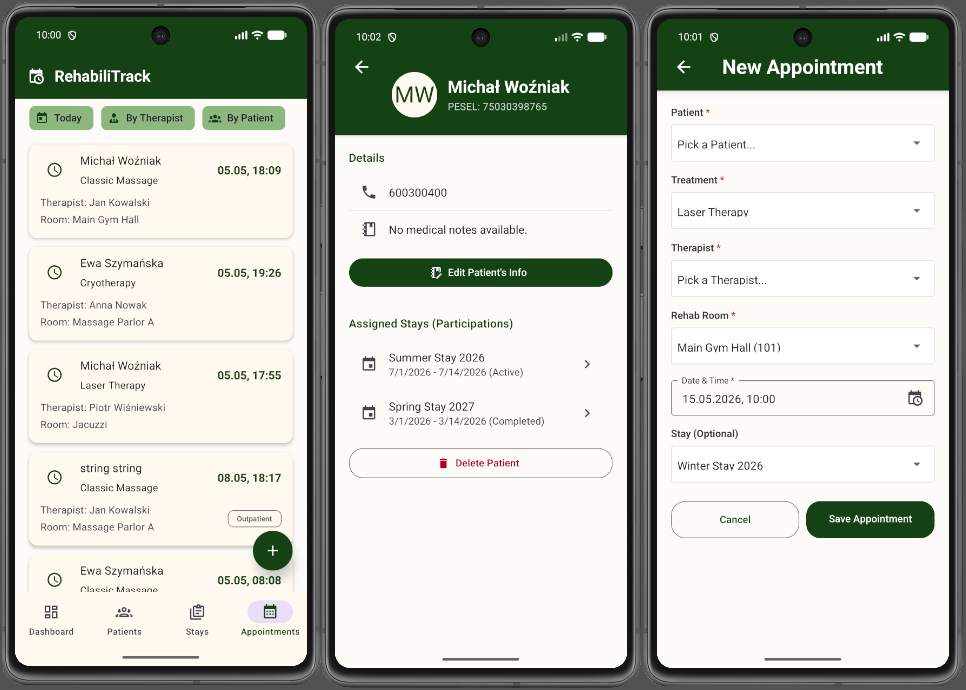

# RehabiliTrack – Rehabilitation Center Management System
##  Work In Progress 

This application is being developed as a portfolio project to showcase my skills in mobile app development (React Native / TypeScript) and building a modern API (C# / .NET / CQRS) in the context of seeking an internship / junior developer role.

## About the project
RehabiliTrack is a comprehensive system designed to facilitate the daily management of rehabilitation facilities. It enables the organization of appointments, management of staff (therapists) and rooms, as well as the coordination of multi-day rehabilitation stays for patients.

The main educational goal of this project was the practical application of architectural patterns (such as CQRS) on the backend side, and designing a seamless client-server architecture as a full-stack project, connecting a .NET REST API with a React Native consumer

## Technologies & Architecture
For this project, I chose a modern and highly sought-after technology stack:

### Frontend (Mobile) 
* React Native – building a cross-platform mobile application.
* TypeScript – strong typing of data models (DTOs) ensuring type safety.
* React Navigation – handling smooth navigation (Stacks, route parameters).
* React Native Paper – a consistent UI based on Material Design principles.
* Context API – application state management.

### Backend (API)
* C# & .NET 8 – a robust and high-performance server environment.
* Entity Framework Core – ORM for object-relational mapping (SQL Database).
* MediatR – implementation of the CQRS (Command Query Responsibility Segregation) pattern.

#### Query Architecture: Utilizing "flat" DTOs for write operations (POST/PUT - passing IDs) and nested DTOs (Nested JSONs) for read operations (GET - building full entity relations).

## Implemented Features (Current State)
* Therapist Management: Adding, editing (including roles), deleting, and displaying a list of employees using Dropdown Pickers that fetch dictionaries from the API.

* Stays Management: Creating multi-day stays with a defined maximum capacity. Date validation using an integrated native calendar (react-native-date-picker).

* Stay Participations: Junction table logic – dynamically assigning and enrolling patients to specific stays.

* Appointments Management: A full appointment scheduling flow connecting a Patient, Therapist, Rehab Room, and Treatment.

## Screenshots


## Upcoming Features 
The project is continuously evolving. The next steps I plan to implement include:

[ ] Full-Stack Containerization: Creating a comprehensive `docker-compose.yml` file to orchestrate the entire application stack (API, SQL Database, and potentially a web client) for a seamless, "one-click" local development setup.

[ ] Filtering & Sorting: Adding functional filters to the appointments list (e.g., "Today only", "By Therapist").

[ ] Global Error Handling: Improved user notifications (Toasts/Snackbars) in case of network issues.

[ ] Data Pagination: Optimizing API list fetching via pagination (using FlatList onEndReached).

## Running the project locally
### Prerequisites
* Node.js (v18+)
* Yarn or pnpm
* React Native environment setup (Android Studio / Xcode)
* .NET SDK

**Frontend Setup**
```bash
# Clone the repository
git clone https://github.com/YourUsername/RehabiliTrack.git

# Navigate to the mobile app folder
cd RehabiliTrack/mobile

# Install dependencies
pnpm install

# Run the app on Android
pnpm react-native run-android
```

**Backend Setup (API & Database)**

```bash
# Navigate to the API folder
cd RehabiliTrack/api

# 1. Start the database using Docker 
 docker-compose up -d

# 2. Apply Entity Framework migrations to create the database schema
dotnet ef database update

# 3. Run the server
dotnet run
```
